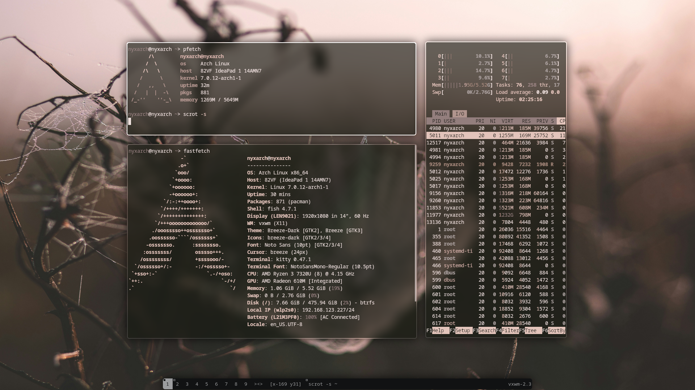
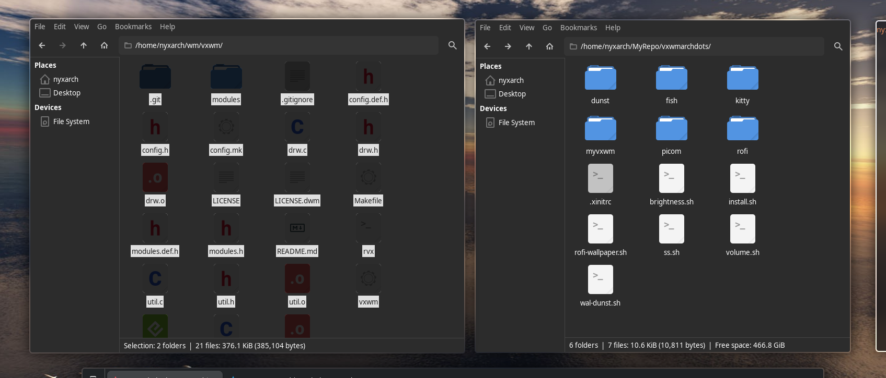

# aetherwm

A tiling window manager **for X11**, based on a clean rewrite of **dwm 6.7**,
that brings back the features of the *vxwm* fork: infinite tags with a pannable
canvas, gaps, per-tag floating, enhanced toggle-floating, directional focus and
movement, fullscreen, live `xrdb` reload and pywal colour theming.

```
+--------------------------------------------------------------+
|   [1][2][3][4]  []<>]  term                     status text   |
+--------------------------------------------------------------+
|                        |                                      |
|      master area       |          stacking area              |
|      (default 55%)     |                                      |
|                        |                                      |
|                        |                                      |
+--------------------------------------------------------------+
|                         bar (bottom)                          |
+--------------------------------------------------------------+
```

## Features

- **Infinite tags & canvas** — every tag is an unbounded plane. Pan the canvas
  (`Super+Shift+arrows`), pin windows (`Super+Ctrl+z`), center the focused
  window (`Super+Shift+d`), return to the origin (`Super+r`).
- **Gaps** — inner/outer gaps, adjustable at runtime (`Super+minus/equal`).
- **Layouts** — tiled (master + stack, **default**), floating and monocle.
- **Enhanced toggle floating** — float a window or restore it to its saved tiled
  geometry (compiled but unbound by default; `Super+q` is reserved for closing
  windows).
- **Directional focus & move** (`Alt+arrows`, `Super+arrows`) —
  focus the nearest window in a direction; move/resize windows with the keyboard.
- **Fullscreen** (`Super+Shift+f`), **togglefloating** (`Super+Shift+space`).
- **Live `xrdb` reload** (`Super+F5`) — apply pywal palettes without restarting.
- **Built-in bars** — top or bottom, with adjustable height and optional
  centered "pill" padding (`BAR_HEIGHT`, `BAR_PADDING`).

## Repository layout

```
aetherwm/
├── vxwm/           # the window manager (rewrite of dwm 6.7 + modules)
│   └── modules/    # self-contained feature modules (see MODULES.md)
├── config/         # dotfiles: dunst, fish, kitty, picom, rofi, wal template
├── scripts/        # screenshot, wallpaper, volume, brightness, wal-dunst
├── wallpapers/     # bundled wallhaven images
├── screenshots/    # screenshots
├── install.sh      # installer (flags: --wm, --configs, --all, --dry-run, --uninstall)
├── uninstall.sh    # removes deployed files and restores backups
├── .xinitrc        # example session entry (startx)
└── docs/           # ANALISIS.md (original-state analysis), ARQUITECTURA.md
```

## Dependencies

- **Build (vxwm):** `base-devel make libx11 libxft libxinerama`
- **Runtime apps:** `kitty dunst xwallpaper picom rofi dmenu thunar scrot
  brightnessctl xdotool`
- **Audio (volume.sh):** `pipewire pipewire-pulse wireplumber` (provides `wpctl`)
- **Theming:** `python-pywal`, `papirus-icon-theme`, a Nerd Font
  (`ttf-jetbrains-mono-nerd`)
- **X session:** `xorg-server xorg-xinit xterm`

`vcompmgr` (ZOOM support) is optional; the ZOOM module is off by default.

## Installation (Arch Linux)

```sh
git clone https://github.com/<you>/aetherwm && cd aetherwm
./install.sh --all        # builds & installs vxwm + deploys configs/scripts
./install.sh --wm         # only build & install the WM
./install.sh --configs    # only deploy dotfiles/scripts/wallpapers
./install.sh --dry-run    # preview without changing anything
./install.sh --uninstall  # remove deployed files and restore backups
```

Run `startx` and the session in `.xinitrc` will start the compositor,
wallpaper and vxwm. Alternatively add the vxwm session for your login manager:

```
exec /usr/local/bin/vxwm
```

## Keybindings (defaults)

| Keys | Action |
|---|---|
| `Super+p` / `Super+Shift+Return` | rofi / kitty |
| `Super+t` / `Super+w` / `Super+e` | kitty / brave / thunar |
| `Super+q` | close focused window |
| `Super+Shift+q` | quit |
| `Super+space` | toggle between current and previous layout |
| `Super+f` / `Super+Shift+t` / `Super+m` | tiled / floating / monocle |
| `Super+Shift+f` | fullscreen |
| `Super+Shift+space` | toggle floating on the focused window |
| `Super+j` `Super+k` | focus next / previous |
| `Alt+arrows` | directional focus |
| `Super+arrows` / `Super+Ctrl+arrows` | move / resize window (keyboard) |
| `Super+minus` `Super+equal` `Super+Shift+equal` | gaps -- / ++ / reset |
| `Super+[1..9]` `Alt+[1..9]` | view / tag |
| `Super+r` / `Super+Shift+arrows` | home canvas / pan canvas |
| `Super+Shift+d` / `Super+Ctrl+z` | center window / pin window |
| `Super+F5` | reload colours from Xresources |
| `Super+Shift+w` / `Print` | wallpaper picker / screenshot |
| `XF86Audio*` `XF86MonBrightness*` | volume / brightness scripts |

Full list in `vxwm/vxwm.1` and `vxwm/config.def.h`.

## Screenshots




## Documentation

- `vxwm/modules/MODULES.md` — how the module framework works and how to add a
  module.
- `docs/ARQUITECTURA.md` — internal architecture (startup, event loop, module
  contracts).
- `docs/ANALISIS.md` — the original analysis of the vxwm fork that this rewrite
  is based on.

## License

MIT. See `LICENSE` and `LICENSE.dwm` (upstream dwm / vxwm copyright holders).
